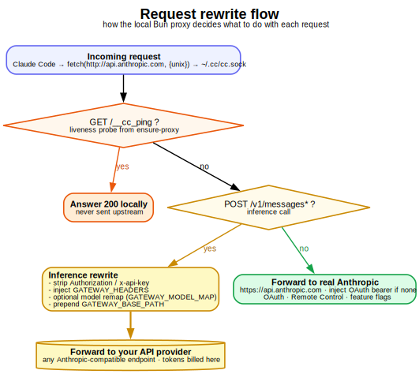

# claude-code-split-billing

Keep Claude Code's **Remote Control** (which needs a `claude.ai` subscription login)
working, while routing all **LLM inference** to a custom, Anthropic-compatible
**gateway** — so token usage is billed to that gateway instead of consuming your
subscription quota.

- Log in with your **subscription (OAuth)** → Remote Control works: you can view and
  drive this machine's sessions from `claude.ai/code` and the mobile app.
- A small local proxy reroutes inference requests (`POST /v1/messages*`) to **your
  gateway**, so per-token inference is billed there, **not** against your subscription.

<p align="center">
  
</p>

---

## ⚠️ Disclaimer

- Your subscription fee is still due. Its role is reduced to "paying for Remote
  Control". You only save the **per-token inference cost** — worth it only if your
  gateway's tokens are meaningfully cheaper than your subscription's included usage.
- This relies on undocumented client behavior and sits at the edge of the Terms of
  Service. A future Claude Code release may break it. **Use at your own risk.**
- Provided under the MIT license with no warranty. You are responsible for complying
  with the terms of every service you connect to.

---

## How it works

Claude Code makes two kinds of network requests that go to **different destinations**:

| Traffic | Destination | Goes through `ANTHROPIC_BASE_URL`? |
|---|---|---|
| **Inference** `POST /v1/messages*` | decided by `ANTHROPIC_BASE_URL` | ✅ yes → we hijack this |
| **Control plane** (OAuth refresh, Remote Control register/poll, feature-flag eligibility, `claude.ai` MCP) | fixed Anthropic hosts | ❌ no → passes through untouched |

Key insights:

1. **Remote Control is gated on the *auth type*, not the base URL.** As long as you log
   in with OAuth (and do **not** set `ANTHROPIC_API_KEY`), Remote Control stays
   eligible even after you change `ANTHROPIC_BASE_URL`. Setting an API key is what
   disables it.
2. **The control plane talks to Anthropic directly**, so the local proxy only needs to
   handle inference and can pass everything else straight through.
3. Therefore the whole solution is: **one** OAuth-logged-in Claude Code + **one** local
   reverse proxy that rewrites `/v1/messages` to your gateway (injecting the gateway's
   auth headers and, optionally, remapping the model id) and forwards everything else to
   the Anthropic control plane.

The local proxy decides what to do with each request as follows:

<p align="center">
  
</p>

### Two gotchas this kit handles for you

- **Node may not trust your network's TLS-intercepting root CA.** Some corporate
  networks man-in-the-middle HTTPS with their own root CA. Windows/macOS may trust it,
  but **Node ships its own trust store and won't by default**, so reaching the control
  plane fails with `unable to get local issuer certificate`. The eligibility check then
  fails and `--remote-control` is silently ignored
  ("Couldn't verify Remote Control eligibility"). Fix: export the corporate root CA to a
  PEM and feed it to Node via `NODE_EXTRA_CA_CERTS` (see `scripts/setup-ca.*`). **If your
  network does not intercept TLS, you can skip this entirely.**
- **`--remote-control` is a launch flag, not a slash command.** Typing
  `/remote-control` in a session returns "Unknown command". This kit enables it via
  `enableRemoteControlByDefault: true` in an isolated `settings.json`, so you never need
  the flag.

---

## Requirements

- [Claude Code](https://docs.anthropic.com/en/docs/claude-code) CLI installed and on your `PATH`.
- Node.js ≥ 18.
- A Claude **Pro/Max subscription** (for OAuth login + Remote Control).
- A reachable **Anthropic-compatible inference gateway** and whatever credentials it needs.

---

## Repository layout

```
claude-code-split-billing/
├── README.md
├── LICENSE
├── .gitignore
├── .env.example              # template for gateway config — copy to .env
├── package.json
├── src/
│   ├── proxy.js              # the reverse proxy: inference -> gateway, rest -> control plane
│   └── ensure-proxy.js       # idempotent: starts the proxy only if not already running
├── bin/
│   ├── cc.cmd                # Windows launcher wrapping `claude`
│   └── cc                    # macOS/Linux launcher wrapping `claude`
├── config/
│   └── settings.example.json # enableRemoteControlByDefault: true
└── scripts/
    ├── setup-config.ps1 / .sh   # create the isolated config dir + enable Remote Control
    ├── setup-ca.ps1 / .sh       # (optional) export corporate root CA for Node to trust
    └── test-control-plane.js    # TLS reachability check for the control-plane hosts
```

Generated/secret files are git-ignored: `.env`, `ca-bundle.pem`, `*.pem`,
`.claude-config/`, `*.log`.

---

## Setup

### 1. Get the code and configure the gateway

```bash
git clone <your-fork-url> claude-code-split-billing
cd claude-code-split-billing
cp .env.example .env          # Windows: copy .env.example .env
```

Edit `.env` and fill in your gateway:

- `GATEWAY_HOST` — the gateway hostname (required).
- `GATEWAY_BASE_PATH` — path prefix before `/v1/messages` (empty if served at root).
- `GATEWAY_HEADERS` — JSON of headers to inject for auth/identity. **Your secret key
  goes here**, e.g. `{"Authorization":"Bearer <TOKEN>"}` or
  `{"<AUTH_HEADER>":"<KEY>","<USER_HEADER>":"<USER_ID>"}`.
- `GATEWAY_MODEL_MAP` — optional; only if your gateway rejects the model ids Claude Code
  sends. See the [Configuration](#configuration) table.

### 2. (Only if your network intercepts TLS) Trust the corporate root CA

First check whether you even need this:

```bash
node scripts/test-control-plane.js
```

If all hosts report OK, **skip to step 3**. If you see
`unable to get local issuer certificate`, export your corporate root CA:

- **Windows:**
  ```powershell
  powershell -ExecutionPolicy Bypass -File scripts\setup-ca.ps1 -Diagnose
  powershell -ExecutionPolicy Bypass -File scripts\setup-ca.ps1 -RootMatch 'Your Corp Root CA'
  ```
- **macOS/Linux:**
  ```bash
  scripts/setup-ca.sh --diagnose            # find your root CA's issuer name
  scripts/setup-ca.sh /path/to/corp-root-ca.pem
  ```

Both write `ca-bundle.pem` to the repo root and re-run the connectivity test. The
launcher picks it up automatically if present.

### 3. Create the isolated config + enable Remote Control

This keeps a separate config/credentials directory so it never touches your default
`~/.claude.json`.

- **Windows:** `powershell -ExecutionPolicy Bypass -File scripts\setup-config.ps1`
- **macOS/Linux:** `scripts/setup-config.sh`

### 4. Put the launcher on your PATH

Use `cc` exactly like `claude`. Add the `bin/` directory to your `PATH`, or symlink the
launcher somewhere already on it.

- **Windows:** add the repo's `bin\` to your `PATH` (e.g. via *Edit environment
  variables*), or copy `bin\cc.cmd` into a directory already on `PATH`.
- **macOS/Linux:**
  ```bash
  chmod +x bin/cc
  ln -s "$(pwd)/bin/cc" ~/.local/bin/cc   # ensure ~/.local/bin is on your PATH
  ```

### 5. First login

```bash
cc
```

Run `/login` → choose the **subscription (claude.ai)** option → complete OAuth in the
browser. The login is stored in the isolated config dir; you won't need to repeat it.

### 6. Verify

- Ask anything (e.g. `hi`).
- Check `proxy.log`: you should see
  `REQ POST /v1/messages -> <GATEWAY_HOST>.../v1/messages` followed by `RES 200`
  → inference really went to your gateway.
- Startup should **not** show "Couldn't verify Remote Control eligibility".
- Open `claude.ai/code` (or the mobile app's Code tab, same account) and confirm the
  session shows up and is controllable.

---

## Daily usage

Open a terminal and use `cc` as a drop-in for `claude` — all arguments pass through:

```bash
cc                                   # normal interactive session
cc --resume                          # resume picker
cc -c "fix the build"                # continue last session with a prompt
cc --dangerously-skip-permissions    # any launch flag works
```

On each launch, `cc` automatically: isolates the config dir → forces OAuth (clears
`ANTHROPIC_API_KEY`-type vars) → points inference at the local proxy → feeds Node the CA
bundle if present → ensures the proxy is running (`ensure-proxy.js`, idempotent) →
launches `claude`. Remote Control is on by default via `settings.json`.

---

## Configuration

All settings live in `.env` (loaded by `src/proxy.js`). See `.env.example` for the
annotated template.

| Variable | Default | Purpose |
|---|---|---|
| `PROXY_PORT` | `8787` | Port the local proxy listens on. |
| `PROXY_HOST` | `127.0.0.1` | Interface the proxy binds (keep loopback). |
| `GATEWAY_HOST` | — (**required**) | Gateway hostname inference is billed to. |
| `GATEWAY_PORT` | `443` | Gateway TLS port. |
| `GATEWAY_BASE_PATH` | empty | Path prefix prepended before `/v1/messages`. |
| `GATEWAY_HEADERS` | `{}` | JSON of headers to inject on inference (auth/identity). |
| `GATEWAY_STRIP_HEADERS` | `authorization,x-api-key` | Client headers removed before forwarding upstream. |
| `GATEWAY_MODEL_MAP` | empty | JSON `{substring: replacement}`; remaps model ids. Empty = pass through. |
| `GATEWAY_DEFAULT_MODEL` | empty | Model id used only when a request has no/invalid model. |
| `CONTROL_HOST` | `api.anthropic.com` | Control-plane host for non-inference traffic. |

---

## Troubleshooting

| Symptom | Cause / fix |
|---|---|
| `Couldn't verify Remote Control eligibility … flag ignored` | Node doesn't trust the control-plane TLS. Re-run `setup-ca.*` and confirm `NODE_EXTRA_CA_CERTS` points at a valid bundle. |
| `unable to get local issuer certificate` | Same as above — the root CA isn't trusted by Node. |
| Inference not hitting the gateway (subscription quota dropping) | Check `proxy.log` for `/v1/messages` hits; confirm `ANTHROPIC_BASE_URL` points at the proxy, the proxy is running, and `cc` cleared `ANTHROPIC_API_KEY`. |
| Gateway returns the wrong model / a fallback | The model id wasn't accepted. Set `GATEWAY_MODEL_MAP` to remap to ids your gateway knows. |
| Remote Control still doesn't appear | Confirm the isolated `settings.json` has `enableRemoteControlByDefault: true` and you logged in with OAuth (not an API key). |
| `HTTP 400` missing a required header | Your gateway needs a header you didn't inject. Add it to `GATEWAY_HEADERS`. |
| `FATAL: GATEWAY_HOST is not set` | Copy `.env.example` to `.env` and fill in `GATEWAY_HOST`. |

---

## Security notes

- Your gateway secret lives in `.env` (git-ignored). **Never commit it** or place it on a
  shared drive. Rotate it if it leaks.
- The isolated config dir `.claude-config/` holds **OAuth credentials** — equivalent to a
  logged-in session. Protect it accordingly (also git-ignored).
- The proxy binds `127.0.0.1` only and is not exposed to the network.

---

## License

[MIT](./LICENSE)
