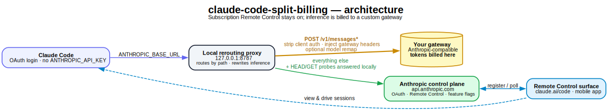

# claude-code-split-billing

Keep Claude Code's **Remote Control** (which needs a `claude.ai` subscription login)
working, while routing all **LLM inference** to a custom, Anthropic-compatible
**gateway** — so token usage is billed to that gateway instead of consuming your
subscription quota.

- Log in with your **subscription (OAuth)** → Remote Control works: you can view and
  drive this machine's sessions from `claude.ai/code` and the mobile app.
- A small local proxy reroutes inference requests (`POST /v1/messages*`) to **your
  gateway**, so per-token inference is billed there, **not** against your subscription.

> **⚠️ Architecture changed (MITM mode).** Recent Claude Code releases (≥ 2.1.197) gate
> Remote Control on a hard check: `new URL(ANTHROPIC_BASE_URL).host === "api.anthropic.com"`.
> Pointing the client at a local proxy URL (the old `ANTHROPIC_BASE_URL=http://127.0.0.1:8787`
> approach) now **disables Remote Control** ("Remote Control is only available when using
> Claude via api.anthropic.com"). The only way to keep BOTH is to leave the base URL as the
> real host and intercept it: **hosts-hijack `api.anthropic.com` → `127.0.0.1` + a local
> HTTPS proxy with a self-signed leaf** trusted via `NODE_EXTRA_CA_CERTS`. That is what this
> kit now does. It is a genuine MITM of an official endpoint — read the Disclaimer.

<p align="center">
  
</p>

---

## ⚠️ Disclaimer

- Your subscription fee is still due. Its role is reduced to "paying for Remote
  Control". You only save the **per-token inference cost** — worth it only if your
  gateway's tokens are meaningfully cheaper than your subscription's included usage.
- **MITM mode intercepts `api.anthropic.com` system-wide** via the hosts file and a
  self-signed certificate. While enabled, every program on the machine (browsers, plain
  `claude`, other SDKs) resolves `api.anthropic.com` to `127.0.0.1`; only this proxy
  (with the matching cert) serves it correctly. Disable it to restore normal behavior.
- This relies on undocumented client behavior and **sits well past the edge of the Terms
  of Service** (impersonating an official host with a self-signed cert). Anthropic is
  actively tightening this (the RC base-URL check, a hard-disabled bypass switch). A
  future release may break it at any time. **Use at your own risk.**
- Provided under the MIT license with no warranty. You are responsible for complying
  with the terms of every service you connect to.

---

## How it works

Claude Code makes two kinds of network requests. Both now go to `api.anthropic.com`
(because Remote Control requires the base URL's host to be exactly that), so we
intercept that host locally and split by path:

| Traffic | Path | Where the proxy sends it |
|---|---|---|
| **Inference** | `POST /v1/messages*` | your gateway (billed there); auth headers injected, model id optionally remapped |
| **Control plane** (OAuth, Remote Control sessions/bridge/heartbeat, feature flags, MCP registry) | everything else | the **real** `api.anthropic.com` |

Key mechanics:

1. **Remote Control is gated on `new URL(ANTHROPIC_BASE_URL).host === "api.anthropic.com"`**
   — a pure string check (it does not verify IP or certificate fingerprint). So we set
   `ANTHROPIC_BASE_URL=https://api.anthropic.com` to pass it.
2. **The hosts file redirects `api.anthropic.com` → `127.0.0.1`**, so that traffic reaches
   the local proxy instead of the real host.
3. **The local proxy terminates TLS** with a self-signed leaf for `api.anthropic.com`,
   signed by a local CA that Node trusts via `NODE_EXTRA_CA_CERTS`.
4. **Reaching the real upstream without a loop:** the proxy resolves the real
   `api.anthropic.com` IP with `dns.resolve4()` (which queries real DNS servers and
   ignores the hosts file), then connects to that IP with `servername`/`Host` =
   `api.anthropic.com`.
5. `OAuth` login (no `ANTHROPIC_API_KEY`) is still required — an API key would disable RC
   independently of the base URL.

The proxy answers the client's `HEAD /` reachability probe locally, sends
`POST /v1/messages*` to the gateway, tunnels WebSocket upgrades (if any) to the real host,
and forwards everything else (including SSE streams like `worker/events/stream`) to the
real control plane.

---

## Requirements

- [Claude Code](https://docs.anthropic.com/en/docs/claude-code) CLI installed and on your `PATH`.
- Node.js ≥ 18 for the local proxy (Claude Code bundles its own runtime). Override with
  `export NODE_BIN=/path/to/node` if the default `node` is too old.
- **openssl** on `PATH` (to generate the local CA + leaf). Git Bash ships one on Windows.
- Ability to **edit the hosts file as Administrator/root**, and to **bind port 443**.
- A Claude **Pro/Max subscription** (OAuth login + Remote Control).
- A reachable **Anthropic-compatible inference gateway** and its credentials.

---

## Repository layout

```
claude-code-split-billing/
├── src/
│   ├── proxy.js              # HTTPS proxy: TLS-terminates api.anthropic.com,
│   │                         #   /v1/messages -> gateway, rest -> real anthropic
│   └── ensure-proxy.js       # idempotent: starts the proxy only if not already running
├── bin/
│   ├── cc.cmd / cc           # launchers wrapping `claude` (Windows / *nix)
├── config/
│   └── settings.example.json # enableRemoteControlByDefault: true
├── scripts/
│   ├── gen-certs.sh          # generate local CA + api.anthropic.com leaf (openssl)
│   ├── hosts-hijack.ps1      # enable/disable/status the api.anthropic.com -> 127.0.0.1 redirect
│   ├── setup-config.ps1 / .sh   # create/choose the config dir + enable Remote Control
│   ├── setup-ca.ps1 / .sh       # (optional) also trust a corporate root CA
│   └── test-control-plane.js    # TLS reachability check
├── certs/                    # generated CA + leaf + keys (git-ignored)
└── .env.example              # gateway config template — copy to .env
```

Generated/secret files are git-ignored: `.env`, `ca-bundle.pem`, `*.pem`, `*.key`,
`certs/`, `.claude-config/`, `*.log`.

---

## Setup

### 1. Get the code and configure the gateway

```bash
git clone <your-fork-url> claude-code-split-billing
cd claude-code-split-billing
cp .env.example .env          # Windows: copy .env.example .env
```

Edit `.env`: `GATEWAY_HOST` (required), `GATEWAY_BASE_PATH`, `GATEWAY_HEADERS`
(**your secret key goes here**), optional `GATEWAY_MODEL_MAP`. Keep `PROXY_PORT=443`.

### 2. Generate the local CA + leaf certificate

```bash
bash scripts/gen-certs.sh          # --force to regenerate
```

Writes `certs/{ca,server}.{key,pem}` and copies the CA to `ca-bundle.pem` (what the
launcher feeds Node via `NODE_EXTRA_CA_CERTS`). All git-ignored.

### 3. Hijack api.anthropic.com to the local proxy (admin / root)

**Windows** (elevated PowerShell):
```powershell
powershell -ExecutionPolicy Bypass -File scripts\hosts-hijack.ps1 enable
powershell -ExecutionPolicy Bypass -File scripts\hosts-hijack.ps1 status
```

**macOS / Linux:**
```bash
sudo scripts/hosts-hijack.sh enable
scripts/hosts-hijack.sh status
```

Adds `127.0.0.1  api.anthropic.com  # cc-split-billing` to the hosts file (tagged for
clean removal) and flushes DNS. `disable` reverts it.

> **macOS / Linux:** port 443 is privileged there (Windows isn't), so the proxy needs one
> extra one-time step — see [Port 443 on macOS/Linux](#port-443-on-macos--linux) below,
> before your first `cc`.
>
> **Windows:** if the hosts write fails with *"being used by another process"*, an AV/VPN/DNS
> tool is holding the file. The script retries with a shared handle; if it still fails, edit
> the file manually (keep the `# cc-split-billing` tag) and run `ipconfig /flushdns`.

### 4. Choose a config directory + enable Remote Control

`setup-config` records which Claude Code config dir `cc` uses (`.cc-config-dir`) and turns
on Remote Control. Run with no flag to be asked; or pass `--inherit` (share your real
`~/.claude`) / `--isolated` (separate login).

- **Windows:** `powershell -ExecutionPolicy Bypass -File scripts\setup-config.ps1`
- **macOS/Linux:** `scripts/setup-config.sh`

### 5. Put the launcher on your PATH, then log in

Add `bin/` to `PATH` (or symlink `bin/cc` / copy `bin\cc.cmd` onto it), then:

```bash
cc
```

Run `/login` → **subscription (claude.ai)** → complete OAuth. (In `--inherit` mode, if
`~/.claude` is already logged in, you can skip this.)

### 6. Verify

- Ask anything (e.g. `hi`).
- `proxy.log` should show **both**:
  `REQ POST /v1/messages* -> <GATEWAY_HOST>...` → `RES 200` (inference billed to gateway),
  **and** `REQ ... -> api.anthropic.com (<real-ip>)` for RC (`sessions`, `presence`,
  `heartbeat`, `worker/events`).
- Startup does **not** show "only available when using Claude via api.anthropic.com" or
  "Couldn't verify Remote Control eligibility".
- Open `claude.ai/code` (or the mobile app) on the same account and confirm the session
  appears and is controllable.

---

## Port 443 on macOS / Linux

The proxy must listen on **443** (the RC check requires the base-URL host with no port, so
traffic always hits 443). Windows lets a normal user bind 443; macOS and Linux do not.
Pick one approach before first launch:

- **Linux — grant Node the capability (one-time, recommended):**
  ```bash
  sudo setcap 'cap_net_bind_service=+ep' "$(command -v node)"
  ```
  Then use `cc` normally — it starts the proxy as your user. Re-run after a Node upgrade.
  (Note: this grants the capability to that `node` binary generally.)

- **Any Unix — run the proxy as root once per boot:**
  ```bash
  sudo -E PROXY_PORT=443 node src/proxy.js >> proxy-stdout.log 2>&1 &
  ```
  `cc`'s `ensure-proxy` sees it already listening and skips spawning. `-E` preserves your
  environment; the proxy reads the rest from `.env`.

- **macOS — redirect 443 → a high port with pf (no root proxy):**
  ```bash
  echo "rdr pass on lo0 inet proto tcp from any to 127.0.0.1 port 443 -> 127.0.0.1 port 8443" \
    | sudo pfctl -ef -
  PROXY_PORT=8443 cc     # proxy binds 8443; the client still reaches 443 via hosts + pf
  ```

If the proxy can't bind, `cc` fails fast with a pointer back to this section (it won't
launch `claude` against a dead proxy).

---

## Daily usage

Use `cc` as a drop-in for `claude` — all arguments pass through:

```bash
cc                                   # normal interactive session
cc --resume
cc --dangerously-skip-permissions
```

On each launch `cc`: sets `ANTHROPIC_BASE_URL=https://api.anthropic.com` → clears
`ANTHROPIC_API_KEY`-type vars (forces OAuth) → feeds Node the CA bundle → checks the hosts
hijack is active (errors out with instructions if not) → ensures the proxy is running
(`ensure-proxy.js`) → launches `claude`. Remote Control is on by default via `settings.json`.

**To temporarily go back to plain, un-intercepted Claude Code** (subscription inference,
normal `api.anthropic.com`): `hosts-hijack.ps1 disable`. Re-`enable` to resume split billing.

---

## Configuration

All settings live in `.env` (loaded by `src/proxy.js`). See `.env.example`.

| Variable | Default | Purpose |
|---|---|---|
| `PROXY_PORT` | `443` | **Must be 443** in MITM mode (host has no port → always 443). |
| `PROXY_HOST` | `127.0.0.1` | Interface the proxy binds (keep loopback). |
| `GATEWAY_HOST` | — (**required**) | Gateway hostname inference is billed to. |
| `GATEWAY_PORT` | `443` | Gateway TLS port. |
| `GATEWAY_BASE_PATH` | empty | Path prefix prepended before `/v1/messages`. |
| `GATEWAY_HEADERS` | `{}` | JSON of headers to inject on inference (auth/identity). |
| `GATEWAY_STRIP_HEADERS` | `authorization,x-api-key` | Client headers removed before forwarding upstream. |
| `GATEWAY_MODEL_MAP` | empty | JSON `{substring: replacement}`; remaps model ids. Empty = pass through. |
| `GATEWAY_DEFAULT_MODEL` | empty | Model id used only when a request has no/invalid model. |
| `CONTROL_HOST` | `api.anthropic.com` | Real control-plane host (reached via resolved IP). |
| `PROXY_CERT_DIR` / `PROXY_TLS_KEY` / `PROXY_TLS_CERT` | `certs/…` | Override cert/key locations. |

---

## Troubleshooting

| Symptom | Cause / fix |
|---|---|
| `Remote Control is only available when using Claude via api.anthropic.com` | `ANTHROPIC_BASE_URL` host isn't `api.anthropic.com`. In MITM mode it must be `https://api.anthropic.com` (set by `cc`) with the hosts hijack active. |
| RC works but inference still hits your subscription | `proxy.log` has no `/v1/messages -> <gateway>`. Confirm the hosts hijack is enabled and the proxy is listening on 443. |
| `EADDRINUSE :443` | Something else owns 443 (old proxy, IIS, Skype). Stop it, or change `PROXY_PORT` (but then the RC check breaks — 443 is required). |
| TLS errors / `unable to verify` in Claude | `NODE_EXTRA_CA_CERTS` isn't pointing at `ca-bundle.pem`, or certs weren't generated. Re-run `gen-certs.sh`; `cc` sets the var automatically. |
| hosts write fails "being used by another process" | AV/VPN/DNS tool locking the file. Script retries; else edit manually + `ipconfig /flushdns`. |
| Gateway returns the wrong model / a fallback | Set `GATEWAY_MODEL_MAP` to ids your gateway knows. |
| `FATAL: GATEWAY_HOST is not set` / `cannot read TLS cert/key` | Fill `.env` / run `gen-certs.sh`. |
| Browser can't reach claude.ai/anthropic while enabled | Expected: the hosts hijack is global. `hosts-hijack.ps1 disable` to restore. |

---

## Security notes

- The generated CA private key (`certs/ca.key`) can mint trusted-by-your-Node certs for
  `api.anthropic.com`. It stays local and git-ignored; **never share it**. The CA is only
  trusted by processes you point at it via `NODE_EXTRA_CA_CERTS` (not the system store).
- Your gateway secret lives in `.env` (git-ignored). Never commit it; rotate if it leaks.
- The isolated config dir `.claude-config/` holds **OAuth credentials**. Protect it.
- The proxy binds `127.0.0.1` only.
- The hosts hijack is **global and persistent** until you `disable` it.

---

## License

[MIT](./LICENSE)
